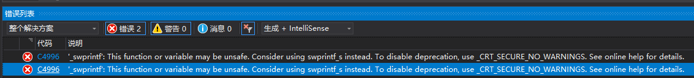

# RookieLearnCode
# 写c++作业的仓库
作业要求：
1.代码中的内存管理规范不是很完善，并存在一些问题：
  找出其中存在BUG或者不完善点，文档列举出来；
  尝试根据内存管理课程的内容，完善并输出一版代码；
2.优化元胞自动机中，进化的算法速度：
  测试代码中有一个测试模式，会计时，通过代码优化，在不改变生成结果的情况下，尽可能让时间缩短
  输出一个耗时最短的界面截图，以及一版新的代码

1.内存管理方面，main函数中new了一块堆内存区域给Painting和Crittersy函数，但在退出主函数时只调用了类的析构函数没有释放掉堆内存区域。
  运行程序次数多了以后可能会有崩溃的风险。
  代码的BUG方面，在VS2019中进行编译时会报出如下错误：
  
  报出错误的原因可能是VS对C++中某些函数作了额外的检查，认为在这里使用_swprintf可能会有内存越界的风险。
  修改方法有两种：在VS项目属性中的预处理器里面加入_CRT_SECURE_NO_WARNINGS这个检查标志或者手动在程序内部添加；也可以按VS的建议使用
  swprintf_s函数来进行替代。
  设计上可能还存在一些缺陷，例如在修改程序运行速度时1-9并非线性的变化，对应的可以在主函数的sleep（）中修改与speed相关的计算方式。
  还有在主函数的循环中使用了goto，似乎goto在c++中已经是一种不建议使用的方式了，对此可以在使用goto的地方直接进行推出函数的操作。
  